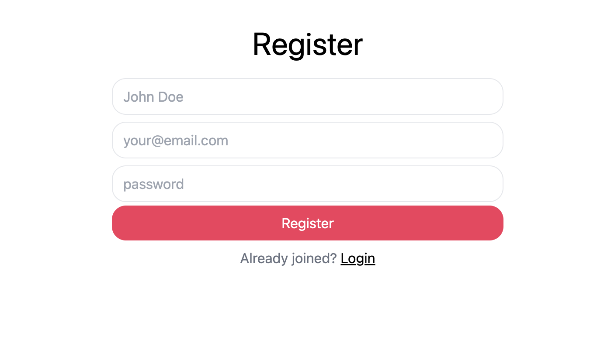
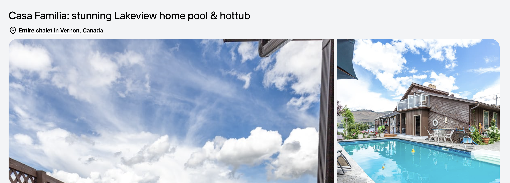
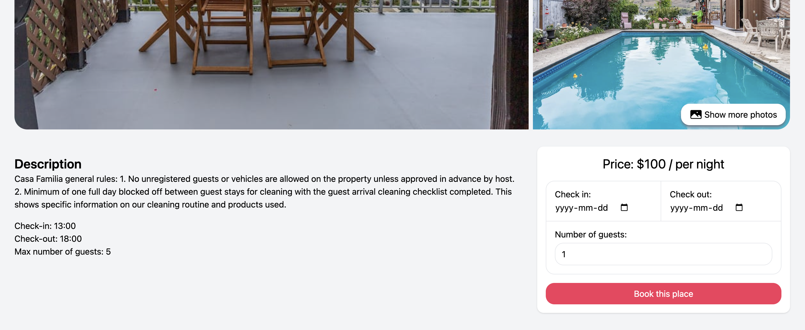
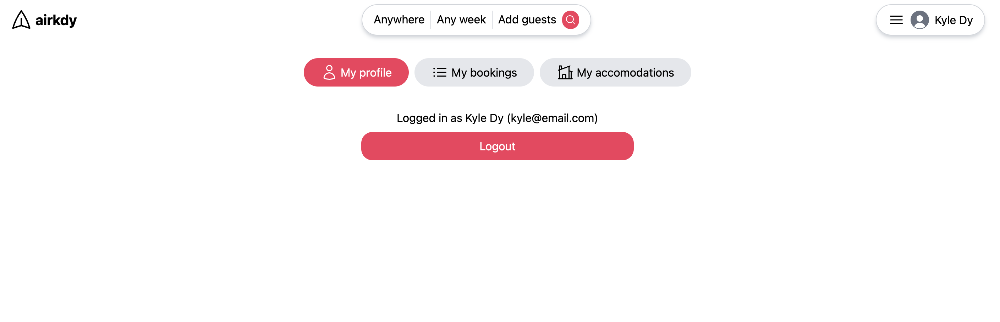
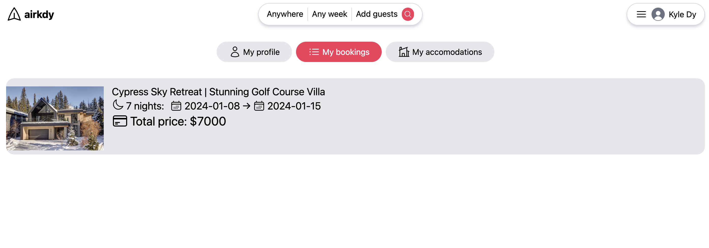
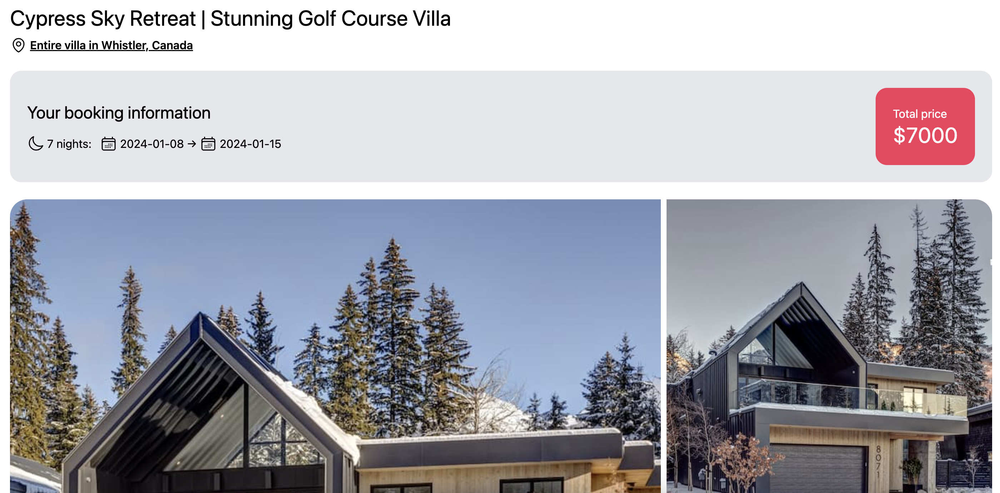
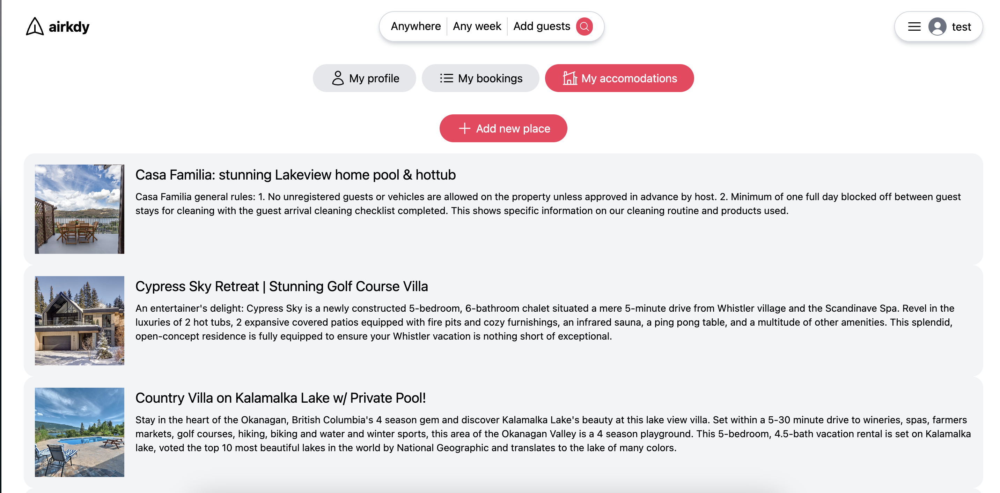

## Features -- video possibly coming soon!

    
    

    
    

    
    

    
    

## Description
Airbnb clone website built using MongoDB, Express, React, and Node.js. Originally kept on my local machine but recently uploaded to GitHub after some modernization.

## Rationale 
I really like the design, interface and functionality of Airbnb's website, so I wanted to see if I could make something similar. This project helped me gain a good introduction to React and full-stack development. I'm also really into traveling so it seemed like a good project to undertake!

## How to run the project locally
- Make sure that you have Node.js installed on your computer. 
- Clone the repository onto your local machine.
- Open an instance of the terminal.
- Set the current working directory to the project folder. 
- Enter "npm install" to install all the required dependencies. 
- Run the client and server-side scripts, as outlined below. 

### Server 
- Set the current working directory to the api folder. 
- Enter "npx nodemon index.js". 

### Client 
- Set the current working directory to the client folder. 
- Enter "yarn dev". 

### Credits 
Majority of the source code and styles are adapted from the YouTube channel "Coding with Dawid".

Most of the icons used in the project are taken from heroicons.com.
